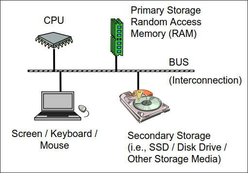
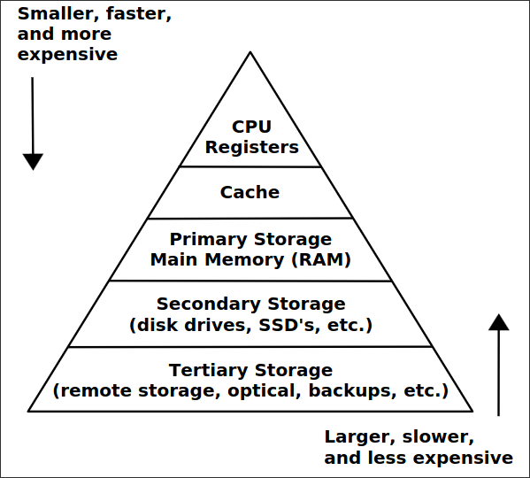
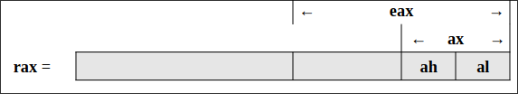
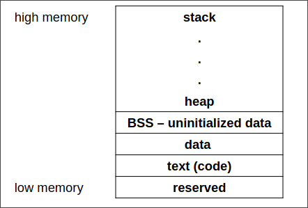
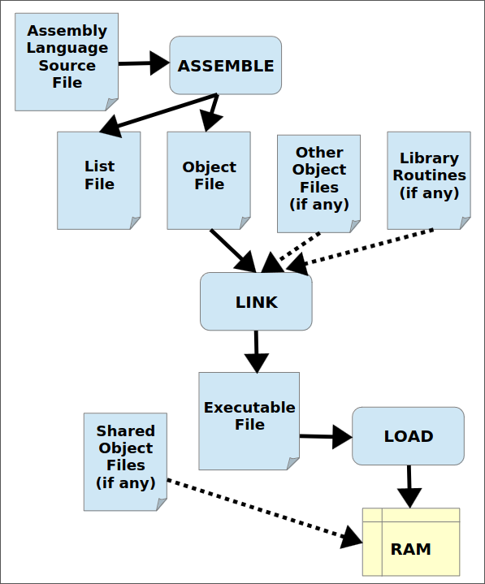

# Architecture Overview
A very basic diagram of the computer architecture is as follows:

> The basic components of a computer include a Central Processing Unit (CPU), Primary Storage or Random Access Memory (RAM), Secondary Storage, Input/Output devices(e.g., screen, keyboard, mouse), and an interconnection referred to a as the Bus.

## Memory Hierarchy
The CPU registers are small, ast, and expensive. Secondary storage devices such as disk drives and Solid State
Drives (SSD's) are larger, slower, and less expensive. The overall goal is to balance
performance with cost.




## Data Storage Sizes
The x86-64 architecture supports a specific set of data storage size elements, all based
on powers of two. The supported storage sizes are as follows: 

| Storage Size | Size (bits) | Size (bytes) |
| ------------ | ----------- | ------------ |
| Byte         | 8-bits      | 1 byte       |
| Word         | 16-bits     | 2 bytes      |
| Double-word  | 32-bits     | 4 bytes      |
| Quadword     | 64-bits     | 8 bytes      |
| Double quadword | 128-bits | 16 bytes     |

### In C/C++

| C/C++ Declaration | Storage | Size (bits) | Size (bytes) |
|---|---|---|---|
| char | Byte | 8-bits | 1 byte |
| short | Word | 16-bits | 2 bytes |
| int | Double-word | 32-bits | 4 bytes |
| unsigned int | Double-word | 32-bits | 4 bytes |
| longs | Quadword | 64-bits | 8 bytes |
| long long | Quadword | 64-bits | 8 bytes |
| char* | Quadword | int* | Quadword | 64-bits | 8 bytes | 64-bits | 8 bytes |
| float | Double-word | 32-bits | 4 bytes |
| double | Quadword | 64-bits | 8 bytes |

> **Note**
> * The asterisk indicates an address variable. For example, int * means the address of an integer.
> * The unsigned byte range can be represented using a number line as follows: `0 |----||----| 255`
> * The signed byte range can also be represented using a number line as follows: `-128 |----| 0 |----| +127`

## CPU Registers
A CPU register, or just register, is a temporary storage or working location built into the
CPU itself (separate from memory). Computations are typically performed by the CPU
using registers.

### General Purpose Registers (GPRs)
* There are sixteen, 64-bit General Purpose Registers (GPRs).
* When using data element sizes less than 64-bits (i.e., 32-bit, 16-bit, or 8-bit), the lower
portion of the register can be accessed by using a different register name as shown in the
table.



| Register | 64-bit | 32-bit | 16-bit | 8-bit |
|---|---|---|---|---|
| rax | rax | eax | ax | al |
| rbx | rbx | ebx | bx | bl |
| rcx | rcx | ecx | cx | cl |
| rdx | rdx | edx | dx | dl |
| rsi | rsi | esi | si | sil |
| rdi | rdi | edi | di | dil |
| rbp | rbp | ebp | bp | bpl |
| rsp | rsp | esp | sp | spl |
| r8 | r8 | r8d | r8w | r8b |
| r9 | r9 | r9d | r9w | r9b |
| r10 | r10 | r10d | r10w | r10b |
| r11 | r11 | r11d | r11w | r11b |
| r12 | r12 | r12d | r12w | r12b |
| r13 | r13 | r13d | r13w | r13b |
| r14 | r14 | r14d | r14w | r14b |
| r15 | r15 | r15d | r15w | r15b |

## System call

A system call is a procedure that provides the interface between a process and the operating system. It is the way by which a computer program requests a service from the kernel of the operating system.

Different operating systems execute different system calls.

In Linux, making a system call involves transferring control from unprivileged user mode to privileged kernel mode; the details of this transfer vary from architecture to architecture. The libraries take care of collecting the system-call arguments and, if necessary, arranging those arguments in the special form necessary to make the system call.

> * READ [SYSCALL](https://syscall.sh/)
> * then `man 2 <syscall> `

eg :
```c
#include <stdio.h>
#include <stdlib.h>
void main(){
	write(1,"Hello",5); //std out syscall
	exit(0); // exit syscall
}

```
## Memory Layout
The general memory layout for a program is as shown:


* Reserved section: Not available to user programs.
* Text (or code) section: Machine language (1's and 0's) that represent the code.
* Data section: Initialized data, including declared variables that have been provided an initial value at assemble-time.
* Uninitialized data section (BSS section): Declared variables that have not been provided an initial value. Value will not be meaningful if accessed before being set.
* Heap: Dynamically allocated data.
* Stack: Starts in high memory and grows downward.

## Assemble/Link/Load Overview


* **Assemble:** The assembler converts human readable source files into object files.
* **Link:** The linker combines object files into an executable file.
* **Load:** The loader loads the executable file into memory so that it can be executed by the CPU.
